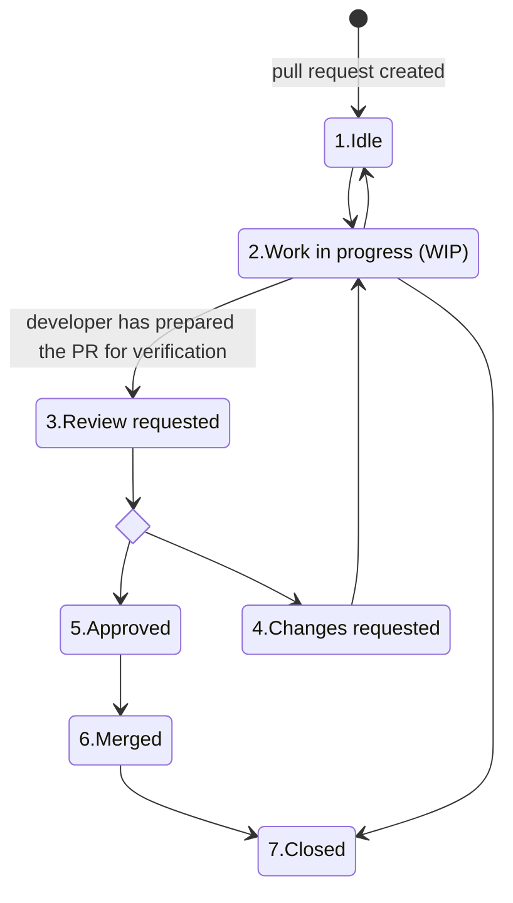

# Contribution Guidelines
Эта страница описывает принципы и правила работы над проектом

## Table of Contents
- [Contribution Guidelines](#contribution-guidelines)
  - [Table of Contents](#table-of-contents)
  - [Principles of contribution](#principles-of-contribution)
    - [1. Transparency](#1-transparency)
    - [2. Certainty](#2-certainty)
    - [3. Single responsibility principle](#3-single-responsibility-principle-srp)
    - [4. KISS](#4-kiss)
  - [Pull requests](#pull-requests)
    - [Branch naming](#1-branch-naming)
    - [PR title](#2-pr-title)
    - [PR description](#3-pr-description)
    - [PR lifecycle](#4-pr-lifecycle)
    - [PR changes](#5-pr-changes)
  - [Code Style](#code-style)
      - [Constants](#1-constants)
    
## Principles of contribution

### 1. Transparency
Принцип транспарентности. Стремись обеспечить максимальную прозрачность вносимых изменений. Например, если в процессе реализации задачи, тебе необходимо сделать что-то не стандартное или не очевидное то крайне важно подготовить максимум информации о том почему это так (например в виде комментария в коде или README файла или документации, или хотя бы ссылки на stack overflow где есть ответ на этот вопрос)

### 2. Certainty
Принцип определенности. Стремись обработать все corner и edge кейсы. Для этого важно понимать область определения значений и состояний, разрабатываемых программ или функций. Это не значит что твоя функция или программа должна одинаково хорошо работать на всей области определения, но она должна уметь их детектировать и обрабатывать (например выбрасывать исключение)

### 3. Single responsibility principle (SRP)
Принцип единой ответственности. Стремись писать подпрограммы таким образом, чтобы они решали только одну конкретную задачу 

### 4. KISS
Будь проще. Не придумывай к задаче более сложного решения, чем ей требуется

## Pull requests
Каждый пулл-реквест должен соответствовать следующим критериям:

### 1. Branch naming
Перед созданием PR необходимо выбрать ветку для влития в базовую (как правило это master). Название ветки должно содержать номер тикета, по которому можно будет найти подробное описание задачи или никнейм автора c описанием изменений, например: `YT-123`, `gitea-5`, `sergey-davydov/fix-big-bug`

### 2. PR title
Заголовок PR должен соответствовать следующим требованиям:
1. Должен быть написан от третьего лица
2. Должен отвечать на вопрос `что было изменено?`
3. Содержать один из префиксов
   - `Изменено -`
   - `Исправлено -`
   - `Добавлено -`
   - `Удалено -`

| 🙏  | Заголовок должно быть не стыдно добавить в Changelog для конечного пользователя |
|-----|---------------------------------------------------------------------------------|

### 3. PR description
Описание PR должно соответствовать следующим требованиям:
1. **Изменения и детали реализации.** Указать по пунктам, какие части программы были затронуты для реализации задачи, особенно неочевидные и не связанные с самой задачей. Если для реализации задачи необходимо добавить или обновить сторонние ассеты или пакеты то необходимо указать в описании PR информацию о том что именно и зачем вы добавили / обновили _(Также обрати внимание на пункты [5.2](#5-pr-changes) и [5.3](#5-pr-changes))_
2. **Задачи.** Ссылка на задачу, которую закрывает это PR. Это может быть в виде префикса ([closes <номер задачи>](https://docs.gitea.io/en-us/automatically-linked-references/#actionable-references-in-pull-requests-and-commit-messages)) или url на внешнюю система учета задач
3. **Чеклист тестирования.** Если задача предполагает тестирование, необходимо составить чеклист с тестами

### 4. PR lifecycle
Каждый PR должен соблюдать нижеописанный жизненный цикл:
1. Idle
2. Work in progress (WIP)
3. Review requested
4. Changes requested
5. Approved
6. Merged
7. Closed



#### В жизненном цикле PR учавствуют по меньшей мере 3 лица
1. Ответственный за PR - разработчик который реализует в PR поставленную задачу
2. Ревьювер - разработчик,не принимавший участие в работе над PR, который проверяет PR на соответсвие требованиям к PR и эффективность реализации задачи  
3. Maintainer - ответсвенное лицо принимающие решение о влитии PR в основную ветку проекта

| Состояние         | Кто может переключить на это состояние? | Когда я могу переключить PR в этом состояние?                                                  | Как я могу перевести PR в это состояние                                                                                                |
|-------------------|----------------------------------------|------------------------------------------------------------------------------------------------|----------------------------------------------------------------------------------------------------------------------------------------|
| Idle              | Ответственный за PR                    | Когда приостанавливаешь работу над PR                                                          | Состояние по-умолчанию, убрать префикс WIP из заголовка                                                                                |
| Work in progress  | Ответственный за PR                    | Когда приступаешь к активной работе над PR                                                     | Добавить префикс WIP к заголовку PR                                                                                                    |
| Review requested  | Ответственный за PR                    | Когда завершил работу над PR и тебе необходимо получить рецензию на изменения                  | Указать рецензента в PR                                                                                                                |
| Changes requested | Ревьювер                               | Когда нашел несоответствие требованиям к PR, не эффективную реализацию или потенциальную ошибку | Указать на проблемные места, сослаться на требования и документацию и запросить дополнительные изменения через форму отправки рецензии |
| Approved          | Ревьювер                               | Когда PR соответствуют требованиям и реализация сочтена эффективной                            | Похвалить 😋 и отправить одобрение  через форму отправки рецензии                                                                      |
| Merged            | Maintainer                             | Когда у PR есть одобобрение на все внесенные изменения                                         | Нажать на кнопку автоматического слияния или влить вручную                                                                             |
| Closed            | Maintainer                             | -                                                                                              | -                                                                                                                                      |


### 5. PR changes
Все изменения должны соответствовать следующим требованиям: 
1. PR не должен содержать не нужных для решения задачи изменений. Таких как временные файлы (создаваемые разработчиком для собственных проверок и тестов) или решение нескольких задач в одном PR (в исключительных ситуациях это допустимо, но тогда необходимо отразить эти изменения и их причину в описании PR)
2. Если для реализации задачи необходимо добавить в проект сторонний ассет или обновить уже имеющийся, то информацию об области и месте применения необходимо уточнить в файле `Assets/Third-Party/README.md` _(Также обрати внимание на пукт [3.2](#3-pr-description))_
3. Если для реализации задачи необходимо добавить в проект пакет или обновить уже имеющийся, то информацию об области и месте применения пакета необходимо уточнить в файле `Packages/README.md` _(Также обрати внимание на пукт [3.2](#3-pr-description))_
4. При разработке часто бывает что нет времени или необходимости решать задачу полностью, но при этом вероятно что к этому придется вернуться в будущем. Такие места необходимо помечать комментарием 'todo' с кратким описанием того что нужно доделать и ссылкой на задачу на дальнейшую доработку 
   ```csharp
   void Update() {
        // TODO: Босс сказал что срочно нужно сделать так чтобы по четвергам программа потребляла меньше электричества,
        // но кажется это не самое лучшее решение
        // Задача на переработку: gitea-666
        if(DateTime.Now.DayOfWeek == DayOfWeek.Thursday)
            Thread.Sleep(20)
   }
   ```
## Code Style
### 1. Constants
Константы, используемые больше, чем в одном месте должны помещаться в файл Constants.cs в соответственный region (если подходящего нет, можно создать), при этом добавив Summary, кратко, но емко описывающую, для чего и как используется константа (если есть единицы измерения - добавить).  
```csharp
        #region СКОРОСТИ ДВИЖЕНИЯ ЖИВОТНЫХ
        /// <summary> Средняя скорость галопа мыши-полёвки, km/h </summary>
        public float MouseGallopSpeed => 1f;
        #endregion
   ```